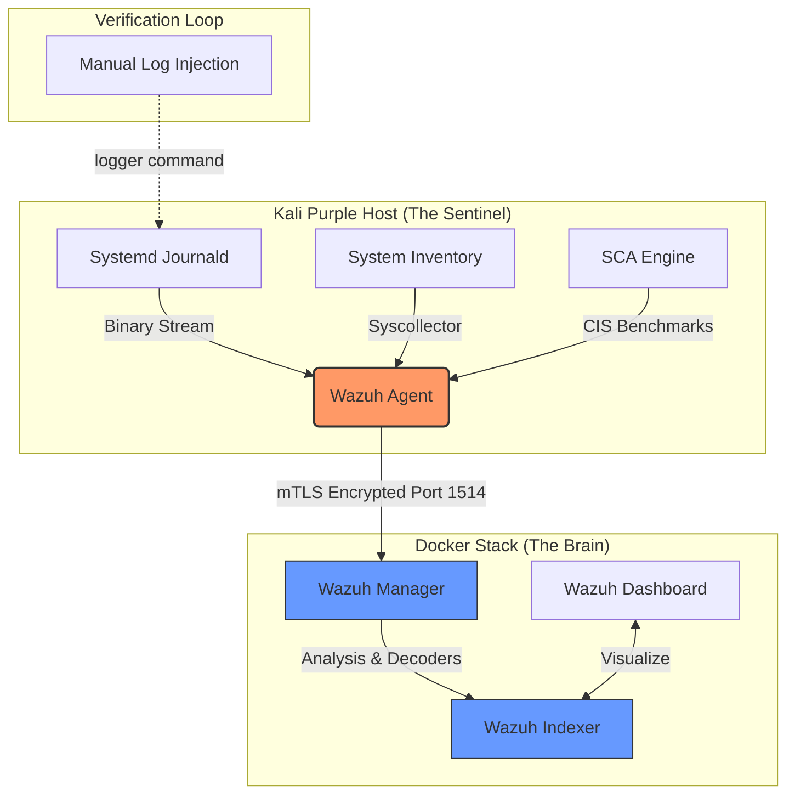

# 📑 Phase 1 Deep-Dive: The Sentinel Foundation

**Technical Specification & Engineering Journal**

## 1. Objective
The goal of Phase 1 was to establish a high-fidelity telemetry pipeline. This involved deploying a centralized Security Information and Event Management (SIEM) system capable of ingestion, indexing, and visualizing security events from a local host in a resource-constrained environment.

---

## 2. Infrastructure Design
I chose a **Hybrid Architecture** to balance isolation and performance.

### A. Docker Stack (The Brain)

The core "Brain" runs within Docker containers to ensure portability and ease of management.

* **Wazuh Indexer:** A highly scalable, full-text search and analysis engine. I custom-tuned the JVM to run within a 2GB RAM envelope.
* **Wazuh Manager:** The engine that parses logs against the Decoders and Ruleset. It maps events to the **MITRE ATT&CK** framework in real-time.
* **Wazuh Dashboard:** The visualization layer used for threat hunting and compliance reporting.

### B. The Sentinel (Host-Based)

Instead of monitoring a remote VM, I deployed the agent on the **Kali Purple Host**.

* **Visibility:** This provides "Ring 0" visibility into hardware interrupts, kernel logs, and raw network interface traffic (wlan0, eth0, and docker bridges).

---

## 3. Engineering Implementation Details

### Certificate Authority (CA) & mTLS

Security was not an afterthought. I implemented a local CA to issue certificates for all nodes. Every transaction between the Indexer, Manager, and Dashboard is encrypted via **Mutual TLS (mTLS)**.

> **Challenge:** Troubleshooting initial handshake failures.
> **Solution:** Verified the `Subject Alternative Name (SAN)` in the `certs.yml` to ensure the container hostnames matched the certificate common names.

### Advanced Log Orchestration

Unlike traditional setups that rely on legacy flat-files, I configured the **Agentic-Purple Sentinel** to utilize **Modern Linux Telemetry** streams to ensure no data loss.

* **Systemd Journald Integration:** Configured the agent to pull directly from the `journald` binary stream. This captures all authentication (SSH/Sudo), kernel, and service events at the source.
* **Inventory & State Monitoring (Syscollector):** Enabled high-frequency (1h) system inventory scans to monitor running processes, open network ports, and installed packages.
* **Proactive Compliance (SCA):** Orchestrated the **Security Configuration Assessment** module to evaluate the host OS against **CIS Benchmarks**.

---

## 🛠️ Engineering Challenges Overcome

### 1. Architecture Mismatch (AMD64 vs ARM64)

**Problem:** Installation failure during agent deployment due to incorrect package architecture detection by the automated installer.
**Solution:** Manually audited the host architecture using `dpkg --print-architecture`. Upon confirming the x86_64 environment, I bypassed the default script and manually pulled the AMD64 `.deb` package, ensuring kernel-level stability and agent-manager compatibility.

---

## 4. Resource Optimization Strategy

To ensure the SOC remains stable on my **16GB RAM and 4 Core CPU hardware**, the stack was "Rightsized" rather than simply minimized.

| Component | Default Config | Agent-Purple Optimized | Strategic Reasoning |
| --- | --- | --- | --- |
| **Indexer** | 1.0 GB | **2.0 GB** | **Stability:** Prevents "Circuit Breaker" trips during heavy indexing. |
| **Manager** | Unlimited | **2.0 GB Limit** | **Containment:** Prevents Java heap spikes from starving the Host OS. |
| **Dashboard** | Default | **1.0 GB Limit** | **Efficiency:** Optimized for single-user visualization. |

---

## 5. Verification & Testing

To prove the system works, I executed a **Log Injection Attack Simulation**:

1. **Command:** `logger "Jan 23 10:00:01 kali sshd[123]: Failed password for root from 10.0.0.5"`
*Note: `logger` writes to the system log, which `journald` picks up instantly.*
2. **Detection:** Within 3 seconds, the Wazuh Manager matched the log against **Rule ID 5710** (sshd: Attempt to login using a non-existent user).
3. **Result:** Alert appeared in the Dashboard with a **Level 5 severity**, successfully categorized under the "Initial Access" tactic.

---

## 6. Phase 1 Conclusion

Phase 1 is now stable. The environment is now "Data Rich," providing the perfect telemetry foundation for the **Phase 2 Agentic Brain**.
