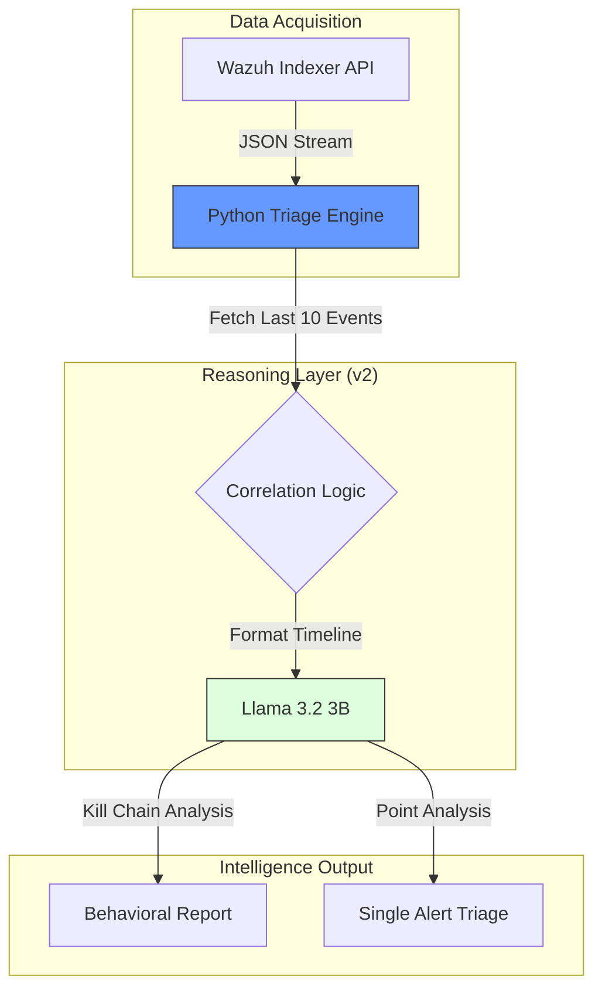
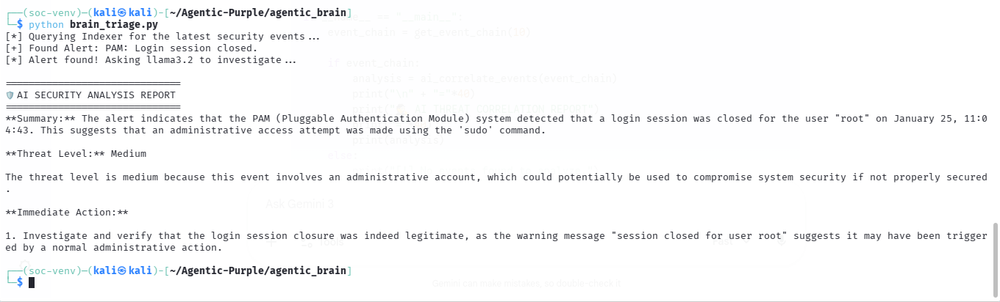
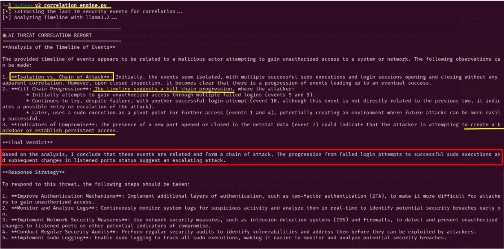

# 🧠 Phase 2 Deep-Dive: The Intelligence Bridge
 
 
 

**From Static Telemetry to Behavioral Intelligence**

## 1. Objective
The goal of Phase 2 was to engineer a custom "middleware" that connects the **Wazuh Indexer** (Data Storage) to **Llama 3.2** (Local Inference). This enables the SOC to move from simple alerting to automated, context-aware threat triage.

## 2. Technical Architecture (Phase 2 Logic)
The following chart illustrates how telemetry flows from the Indexer through our custom Python logic to reach a "Verdict" from the local LLM.

---

## 3. Engineering Challenges & Solutions

### A. The Authentication Barrier (401 Unauthorized)

**Problem:** The Indexer API initially rejected connections.\
**Solution:** Identified that the Indexer maintains a separate internal credential database from the Dashboard. Conducted low-level `curl` probes to verify the REST API handshake, eventually securing the connection via hardened environment variables.

### B. Contextual Prompt Engineering

**Problem:** Raw security logs are "noisy" and lack semantic meaning for standard LLMs.\
**Solution:** Developed a **Cyber Analyst Persona**. By wrapping telemetry in a structured system prompt, I forced the AI to generate actionable KPIs: Summary, Threat Level, and Response Strategy.

---

## 4. Evolution of Intelligence: Proof of Work

To demonstrate the growth of this project, below are the two stages of our Intelligence Bridge development.

### Step 1: Point-in-Time Analysis (Single) (v1_single_triage.py)

Our initial success involved analyzing single, isolated alerts. This proved the "handshake" between Wazuh and the AI worked.

**Detected Event:** `PAM: Login session closed.`

* **AI Analysis (Llama 3.2):**
* **Summary:** "The alert indicates that the login session of the 'root' user has been closed by PAM... indicating elevated privileges were used."
* **Threat Level:** "Medium"

---

### Step 2: Behavioral Correlation Analysis (Chain) (v2_correlation_engine.py)

**The Modern threats are chains, not points:** I upgraded the bridge to extract the **last 10 events**, allowing the AI to identify **Kill Chain Progression**.

As seen in the terminal output below, the AI now distinguishes between isolated noise and a coordinated attack.

**Key Findings from v2:**

* **Isolation vs Chain of Attack:** The AI identified that multiple successful **sudo** executions.
* **Kill Chain Progression:** The AI correctly flagged multiple failed logins followed by a successful `sudo` execution as a "Pivot Point."
* **Persistence Detection:** Identified new ports (netstat event 7) as potential backdoors.

---

## 5. Phase 2 Conclusion

We have successfully transitioned from **Data Collection** to **Behavioral Synthesis**. By moving from v1 to v2, we have proven that local, CPU-bound AI can perform complex threat correlation once thought to require expensive cloud-based SOC platforms.

**Next Step:** Moving into **Phase 3 (LangGraph)** to implement multi-agent verification and memory.
